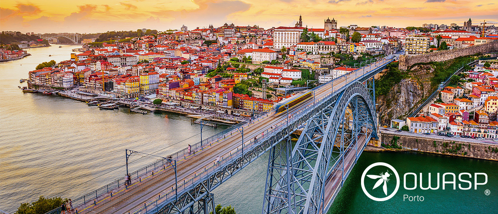

---

layout: col-sidebar
title: OWASP Porto
tags: chapter-porto owasp-oporto owasp-opo chapter-portugal porto oporto portugal 
level: 0
region: Europe
meetup-group: owasp-porto-chapter
country: Portugal
postal-code: 4150

---

<!-- rebuild 1 -->

## Welcome to the OWASP Porto chapter!

The objective of this chapter is to promote application security in the Porto region, through the engagement of the
local community, meetings and events organization, and project participation.

[Join us](https://owasp.org/membership)!

## Follow us and stay up to date:

Use the [Social Links](#social-links) on the right to follow us to stay up to date with our events.

## Next event:

<<<<<<< Updated upstream
**January 14th, 2026. Stay tuned! **
=======
**#9 - The Wall, January 14th, 2026 [meetup.com](https://www.meetup.com/owasp-porto/events/312337721/)**
>>>>>>> Stashed changes

## Participation:

### Call for Talks

Are you interested in speaking at our meetups?
Beginner or advanced, attack or defense, technical or not, submit your talk [here](https://forms.gle/4BagP8fuBgBvdy1Y9).

### Sponsorship

Chapters are led by local leaders in accordance with the [Chapters Policy](/www-policy/operational/chapters). Financial
contributions should only be made online using the authorized online donation button.

### Join Us!

The [Open Worldwide Application Security Project](https://owasp.org) (OWASP) is a nonprofit foundation that works to
improve the security of software. All of our projects ,tools, documents, forums, and chapters are free and open to
anyone interested in improving application security.

Everyone is welcome and encouraged to participate in
our [Projects](/projects/), [Local Chapters](/chapters/), [Events](/events/), [Online Groups](https://groups.google.com/a/owasp.com/){:
target='_blank'}, and [Community Slack Channel](https://owasp.slack.com/){:target='_blank'}. We especially encourage
diversity in all our initiatives. OWASP is a fantastic place to learn about application security, to network, and even
to build your reputation as an expert. We also encourage you to be [become a member](/membership/) or consider
a [donation](/donate/) to support our ongoing work.

## Previous event:

**October 28th, 2025. See it on [meetup.com](https://www.meetup.com/owasp-porto/events/311443120)**

