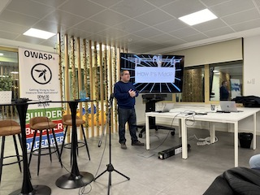

## #1 Kickoff: March 6th, 2024 @ Boost IT

### Agenda:
 **18:00** - Intro and Welcome by the OWASP Porto chapter leadership \
 **18:15** - The Security of Large Language Models by Nuno Pereira \
 **19:10** - SBOM, SBOM, you're an SBOM by Diogo Sousa \
 **20:00** - Drinks & Dinner by Boost IT 

### Talks:

> ### The Security of Large Language Models
> Large Language Models (LLMs) received a lot of attention recently and it is possible to find them integrated into various applications, from well-known chat applications to content creation, search, translation and much more. We will overview LLMs and delve into some details to better understand known attacks.

> #### By Nuno Pereira \[[LinkedIn](https://www.linkedin.com/in/napereira/)\]
> Nuno Pereira taught cybersecurity-related topics for more than 15 years. 

> ### SBOM, SBOM, you're an SBOM
> Software Bill of Materials (SBOM) is a concept that recently has been making waves in SDLC spaces but it isn't entirely new. Most mature languages have a (sometimes) mature package management system, either built-in (e.g., Rust's cargo) or de facto (e.g., Maven) that allows developers to define dependencies, resolve conflicts and do composition analysis.
> SBOMs, however, allow you to take this one step further, making it language-agnostic and allowing components from different ecosystems to use a common language for comparisons and analysis. However, we don't get those features out of the box. For example, consider common libraries in different package repositories - are all OpenSSL packages created equally and equivalent?
> OWASP is playing a part in this via its support for projects like CycloneDX which aims to provide a full-stack BOM standard to cover specific scopes such as the CBOM (Cryptography) and HBOM (Hardware) among others.
> This shift towards software being more transparent and traceable is not without its detractors, as entire business models are predicated on customers using purely opaque boxes.
> In the spirit of the topic, here is a Talk Bill of Topics:
> - Are BOM requirements burdensome?
> - Are we revealing too much of the "secret sauce"?
> - Does having an SBOM instantly make a piece of software more secure?
> - If we take a piece of software and replace every entry in its BOM with fully equivalent packages, one by one, is it still the same software in the end?
> This talk targets a beginner to intermediate audience and will provide an overview of (S)BOMs, their ongoing challenges, and what they can bring to the table in terms of security. 

> #### By Diogo Sousa \[[LinkedIn](https://www.linkedin.com/in/0xdsousa/)\]
> An opinionated individual with an interest in cryptography and its intersection with secure software development.

### Talk Videos
[The Security of Large Language Models by Nuno Pereira](https://youtu.be/hZcDXGJviFQ)

[SBOM, SBOM, you’re an SBOM by Diogo Sousa](https://youtu.be/ApmWkGwd2Mw)

### Meetup Photos

-----------------------------------------------------------

## #2 Tango: May 29th, 2024 @FinTrU

### Agenda:
 **18:00** - Intro and Welcome by the OWASP Porto chapter leadership \
 **18:15** - From Theory to Practice: Navigating the Challenges of Vulnerability Research by Raphael Silva \
 **19:00** - Harnessing Reachability Analysis to Discern Real Threats in Software Dependencies \
 **20:00** - Drinks & Dinner by FinTrU 

### Talks:

> ### From Theory to Practice: Navigating the Challenges of Vulnerability Research
>Transitioning from theoretical knowledge to the practical aspect in web security often presents some extra challenges. Real-world scenarios introduce complexities such as bad character filters and Web Application Firewalls (WAFs), demanding the researcher to investigate some way to bypass these restrictions. Here are some of our learnings: 1) Drawing from collaborative efforts and senior industry research becomes pivotal. 2) Embracing failure as a learning experience is fundamental. 3) Learn a bit about how ethical security research faces legal hurdles in countries like Portugal, hindering progress and discouraging potential researchers. Navigating this bridge from theory to practice in web security requires technical prowess and resilience, and I hope to share some of my learnings from this journey with you in this talk.

> #### By Raphael Silva \[[LinkedIn]( https://www.linkedin.com/in/raphaelcssilva/)\]
> I’m Raphael Silva, an AppSec Analyst at Checkmarx. I've participated in public speaking and public-facing activities, notably a Code Review workshop at AppSec Village at DEFCON30 and talks about AI and AppSec at my former university. I’ve found multiple vulnerabilities in open-source products over the years. I’m always looking for ways to expand my knowledge in the field, be that sharpening my technical skills by reading innovative research, practicing in CTFs, engaging in some bug bounty hunting, and taking certifications. I'm eWPTXv2 certified and currently enrolled in OSCP.

>### Harnessing Reachability Analysis to Discern Real Threats in Software Dependencies
> In this talk, we will dive into the shortcomings of traditional dependency analysis methods, which usually focus on building manifests and metadata, to spot security or performance vulnerabilities in Java projects. While tools like Maven Dependency Checker and Gradle's dependency-analysis plugin are invaluable for managing dependencies, they often fall short when we need quick and precise answers, forcing developers to lean on time-consuming tests and manual code reviews. We believe that a thorough look at how dependencies are actually used in the code—with the help of static and reachability analyses—can be a more effective way to pinpoint real threats in Java dependencies.
> Our goal is to provide attendees with practical strategies for using static and reachability analyses, promoting a more detailed method for managing dependencies and finding vulnerabilities in software applications.

> #### By Joseph Hejderup \[[LinkedIn](https://www.linkedin.com/in/josephhejderup/)\]
> Part-time developer, part-time PhD student, and full-time enthusiast in developing and researching techniques that make package management systems more intelligent and resilient against supply chain problems! Joseph Hejderup (Researcher/Software Engineer at Endor Labs & PhD student at Delft University of Technology) is applying program analysis techniques to understand better how we use third-party components and what risks third-party components entail from a security and maintenance perspective.

### Meetup Photos

## #3 Is a Strike: November 6th, 2024 @ UPTEC Baixa

### Location
UPTEC Baixa (Downtown Porto), Praça do Coronel Pacheco 2, 4050-453 Porto.

### Agenda:
**18:00** - Intro and Welcome by the OWASP Porto chapter leadership \
**18:15** - CVSS v4 – A Better Version of an Imperfect Solution by Mário Leitão-Teixeira \
**19:00** - Searching data on remote encrypted storages with privacy requirements by António Pinto \
**20:00** - Drinks & Dinner.

### Talks:

>### CVSS v4 – A Better Version of an Imperfect Solution
>**Speaker: Mário Leitão-Teixeira** \
>The Common Vulnerability Scoring System (CVSS) is the number-one standard for attributing criticality scores to vulnerabilities to help organizations properly assess and prioritize their Vulnerability Management processes. Today, it plays a fundamental role in organizations and project maintainers worldwide, even more so with the general adoption of CVE. And with NVD as the go-to source for keeping track of new vulnerabilities. These bear a fundamental position in the Infosec community by keeping all information publicly available and easily accessible. We will explore key aspects of the new CVSS version, the challenges it intends to solve, and some persisting limitations, being one major challenge, how to optimize its pivotal role in Vulnerability. Management. Looking forward, I will discuss the future landscape and potential collaboration and open some questions for the journey ahead.
>
>**Bio** \
>I work as an Appsec Analyst at Checkmarx. 'Vulnerability' is part of my daily vocabulary, and I'm never sick of it. I dub myself a 'self-certified idiot' because I love learning and hatching ideas. So much that I've made brainstorming a hobby and kickstarted a team initiative to keep us on the pulse of InfoSec. I'm also currently studying to pass the CEH certification. Contributing to the AppSec Village at RSAC in San Francisco last year? Check. Beyond the keyboard, you catch me reading, writing, or practicing martial arts. As in cybersecurity, I seek constant learning.
>
>Linkedin: [https://www.linkedin.com/in/marioleitao-teixeira/](https://www.linkedin.com/in/marioleitao-teixeira/)

> #### Searching data on remote encrypted storages with privacy requirements
> **Speaker: António Pinto** \
> A combined adoption of cloud-based infrastructure and applications, with the requirements imposed by legislation such as the General Data Protection Regulation (GDPR) create momentum for the greater adoption and use of data encryption.
> When remote data confidentiality is required, the candidate solution is to use cryptography techniques to encrypt all data before transferring it to a remote cloud storage service. In some particular cases, the data sent can also be digitally signed to ensure its source trustworthiness and a cryptography hash can also be computed to assure data integrity and to prevent its manipulation while in transit. If searching within this remotely stored data is required, the simplest and trivial approach consists in transferring all data back to the client, so that it can be decrypted, allowing search operations to be performed over the clear text and at the client side. This presents efficiency and performance problems. The use of searchable encryption mechanisms can address some of these issues and take part of a secure, confidential and off-premises storage of data that is also capable of assuring the integrity and authenticity of the stored data while supporting server-side log searching and retrieval.\
> In this talk we present the concept of searchable encryption of remotely stored encrypted data. We address the related concepts of trapdoor, index, reverse index and discuss the performance cost of these operations.
>
> **Bio**\
> António Pinto has a PhD from Porto University (2010). Currently, he is a Professor (Professor Coordenador com Agregação) at Escola Superior de Tecnologia e Gestão (ESTG) of the Polytechnic Institute of Porto. He gives courses on computer networks, data privacy, ethical hacking and digital forensics. He is also a researcher of CRACS at INESC TEC research institute. His current research interests include computer and network security, digital forensics, and data privacy. António Pinto has published 50+ papers and participated in 10+ research projects, including the European projects. He also holds both ISO 27001 Lead Implementer and ISO 27001 Lead Auditor certifications.
>
> Linkedin: [https://www.linkedin.com/in/pintoantonio](https://www.linkedin.com/in/pintoantonio)

### Meetup Photos

-----------------------------------------------------------

## #4 A New Hope: January 15th, 2025 @ Celfocus Porto.

### Agenda
**18:00** - Intro and Welcome by the OWASP Porto chapter leadership
**18:15** - Lightning Recap: Highlights from BSides Lisbon 2024 by Celfocus Appsec Team, hosted by Pedro Tarrinho
**19:00** - Do not Live in the Shadows (APIs) by Teresa Pereira
**20:00** - Drinks & Dinner by Celfocus.

-------------------------------------------------------------------------------------------------------

### Talks

> ### Lightning Recap: Highlights from BSides Lisbon 2024
> **Host: Pedro Tarrinho; Speakers: Mariana Bento, José Neves, Ruben Silva, Samuel Azriel, Diogo Gomes**
>
>*In this rapid-fire session, dive into key insights and breakthroughs from BSides Lisbon 2024. Hosted by Pedro Tarrinho, this panel will bring key topics and discussions from one of Portugal's major security conferences. Join the Celfocus AppSec team as they deliver presentations highlighting innovative strategies, emerging threats, and practical takeaways that resonated throughout the conference. Whether you missed the event or want a condensed recap, join us in this session to catch up on the latest developments from BSides Lisbon, where we will go over the following selection of talks*:
>
>- AI will take our job + GenAI Cybercrime Armageddon by [Mariana Bento](https://www.linkedin.com/in/marianabentoo/) and [José Neves](https://www.linkedin.com/in/jos%C3%A9-neves-b938581bb/).
>- Weaponized Ads - Malvertising by [Ruben Silva](https://www.linkedin.com/in/ruben-silva85/)
>- Enhancing Secrets Management by [Samuel Azriel](https://www.linkedin.com/in/azrsamuel/)
>- Advanced Android Detection Evasion Tactics by [Diogo Gomes](https://www.linkedin.com/in/diogo-correia-gomes/)

> ### Do not Live in the Shadows (APIs)
> **Speaker: Teresa Pereira**
>
>Shadow APIs — undocumented, unmanaged, or hidden APIs within an organization’s ecosystem — pose a significant risk to security, compliance, and operational resilience. These APIs often emerge due to rapid development cycles, decentralized practices, or legacy systems, creating critical blind spots for development and security teams.
>This talk explores the concept of Shadow APIs, starting with a clear definition and their origins, and examines the multifaceted risks they introduce to software development. Through real-world examples, we will highlight the potential consequences of ignoring these “hidden doors” and discuss strategies for their identification, management, and mitigation. By the end of this session, you will gain actionable insights and strategies to reduce the risks posed by Shadow APIs and build more resilient, secure, and compliant systems.
>
>**Bio**
>I’m currently working as a Cyber Threat Hunter at Siemens Energy. Before this, I worked as a Pentester at KPMG Portugal for nearly three years. My journey into API Security began in 2022, and by 2023, I was speaking at apidays Paris. In 2024, I was a speaker at apidays London and apidays Paris.
>
>LinkedIn: https://www.linkedin.com/in/maria-teresa-pereira/

### Meetup Photos

