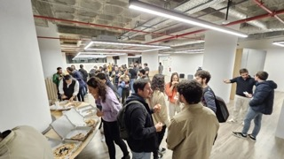

# Events in 2024

See them **[here](past_meetups_2024)**

# Events in 2025

## #4 A New Hope: January 15th, 2025 @ Celfocus Porto.

### Agenda
**18:00** - Intro and Welcome by the OWASP Porto chapter  \
**18:15** - Lightning Recap: Highlights from BSides Lisbon 2024 by Celfocus Appsec Team, hosted by Pedro Tarrinho \
**19:00** - Do not Live in the Shadows (APIs) by Teresa Pereira \
**20:00** - Drinks & Dinner by Celfocus.\

### Talks

> ### Lightning Recap: Highlights from BSides Lisbon 2024
> **Host: Pedro Tarrinho; Speakers: Mariana Bento, José Neves, Ruben Silva, Samuel Azriel, Diogo Gomes**
>
>*In this rapid-fire session, dive into key insights and breakthroughs from BSides Lisbon 2024. Hosted by Pedro Tarrinho, this panel will bring key topics and discussions from one of Portugal's major security conferences. Join the Celfocus AppSec team as they deliver presentations highlighting innovative strategies, emerging threats, and practical takeaways that resonated throughout the conference. Whether you missed the event or want a condensed recap, join us in this session to catch up on the latest developments from BSides Lisbon, where we will go over the following selection of talks*:
>
>- AI will take our job + GenAI Cybercrime Armageddon by [Mariana Bento](https://www.linkedin.com/in/marianabentoo/) and [José Neves](https://www.linkedin.com/in/jos%C3%A9-neves-b938581bb/).
>- Weaponized Ads - Malvertising by [Ruben Silva](https://www.linkedin.com/in/ruben-silva85/)
>- Enhancing Secrets Management by [Samuel Azriel](https://www.linkedin.com/in/azrsamuel/)
>- Advanced Android Detection Evasion Tactics by [Diogo Gomes](https://www.linkedin.com/in/diogo-correia-gomes/)

> ### Do not Live in the Shadows (APIs)
> **Speaker: Teresa Pereira**
>
>Shadow APIs — undocumented, unmanaged, or hidden APIs within an organization’s ecosystem — pose a significant risk to security, compliance, and operational resilience. These APIs often emerge due to rapid development cycles, decentralized practices, or legacy systems, creating critical blind spots for development and security teams.
>This talk explores the concept of Shadow APIs, starting with a clear definition and their origins, and examines the multifaceted risks they introduce to software development. Through real-world examples, we will highlight the potential consequences of ignoring these “hidden doors” and discuss strategies for their identification, management, and mitigation. By the end of this session, you will gain actionable insights and strategies to reduce the risks posed by Shadow APIs and build more resilient, secure, and compliant systems.
>
>**Bio**
>I’m currently working as a Cyber Threat Hunter at Siemens Energy. Before this, I worked as a Pentester at KPMG Portugal for nearly three years. My journey into API Security began in 2022, and by 2023, I was speaking at apidays Paris. In 2024, I was a speaker at apidays London and apidays Paris.
>
>LinkedIn: [https://www.linkedin.com/in/maria-teresa-pereira/](https://www.linkedin.com/in/maria-teresa-pereira/)

### Meetup Photos

-----------------------------------------------------------

## #5 Jupiter: April 15th, 2025 @ Critical Techworks Porto.

### Agenda
**18:00** - Intro and Welcome by the OWASP Porto chapter leadership \
**18:15** - Hacking Embedded Devices - From Black Box to UID 0 by Zezadas and David Silva \
**19:00** - Lessons Learned and How Not to Choose Your Next Drive by Paulo Silva \
**20:00** - Drinks & Dinner by Critical Techworks. \

### Talks

> ### Hacking Embedded Devices - From Black Box to UID 0
> **Speaker: Zezadas and David Silva**
>
> Prepare to bend the rules of time and uncover the secrets of an embedded device in a way that even the most adventurous time traveler wouldn’t even dream to explore. In this enlightening presentation, Zezadas, a security researcher, leads you through the remarkable process of gaining root access in an unsuspecting video converter embedded device. Witness the fusion of expertise and creative problem-solving as Zezadas shares a step-by-step account of their exploits. Discover firsthand that hacking embedded devices, often perceived as daunting, can be accessible, enjoyable, and, most importantly, a journey through time. Whether you’re a security aficionado or simply curious about the intersection of technology and time-travel, this talk promises to entertain, educate, and inspire.
>
> **Bios**
> **Zezadas** is a dedicated security researcher with a strong passion for exploring the intricacies of hardware hacking. With a wide-ranging skill set and an unyielding curiosity. As a committed advocate for cybersecurity education, Zezadas frequently shares knowledge and experiences at renowned cybersecurity conferences worldwide. These include events such as BsidesLisbon, BsidesBangalore, BerlinSides, AlligatorCon, WarCon, 0xOPOSEC, and many others.
>
>Linkedin: [https://www.linkedin.com/in/zezadas/](https://www.linkedin.com/in/zezadas/)

> **David Silva** is a Software Engineer with professional experience in full-stack software development, project management, and cloud deployments in Kubernetes, AWS, Google Cloud, and Azure.
> His professional experience, combined with a strong interest in most technology-related fields, including cyber security, is reflected in his problem-solving skills and interest in understanding how things work and how one can give new uses to existing technology.
>
> LinkedIn: [https://www.linkedin.com/in/dmpasilva/](https://www.linkedin.com/in/dmpasilva/)

> ### Lessons Learned and How Not to Choose Your Next Drive
> **Speaker: Paulo Silva** 
>
>Don't worry, we can (also) hear your thoughts—"No, the car manufacturers' security talk again. No!" But fear not, this time we're shifting gears. Instead of focusing on cars, we'll use lessons from our research to highlight security pitfalls that plague organizations across industries. From cloud bucket misconfigurations to BOLA bugs giving users more power than a valet with your Ferrari keys, we'll share real-world lessons learned, laugh at the chaos, and discuss how to avoid these traps. Anyway, those fancy PoCs may strike again: the best way to prove impact and get rid of annoying web flaws. Buckle up—it’s a wild ride!

> **Bio**
> **Paulo** is a security practitioner with a solid background in software development, who has spent the last decade focused on identifying critical vulnerabilities and breaking software. He is a long-time OWASP volunteer and co-leader of the OWASP API Security Project, where he advocates for secure API practices and contributes significantly to mitigating security risks in the API landscape.
>
> LinkedIn: [https://www.linkedin.com/in/devpauloasilva/](https://www.linkedin.com/in/devpauloasilva/)

### Meetup Photos

-------------------------------------------------------------------------------------------------------

## #5 The Farmer: July 2nd, 2025 @ Ordem dos Engenheiros - Região Norte (OERN).

We are excited to bring you another

### Agenda

**18:00** - Intro and Welcome by the OWASP Porto chapter leadership \
**18:15** - Applying Threat Modelling in modern development environments by Gonçalo Matias \
**19:00** - Jedi^WGenAI Mind Tricks - Are these the secure chatbots you’re looking for? by Bruno Morisson \
**19:45** - Drinks & Dinner by OERN. \

### Talks

> ### Applying Threat Modelling in modern development environments
> **Speaker: Gonçalo Matias**
>
> In today’s fast-paced software development, understanding and mitigating security risk is paramount. Adopting security activities early in the software development lifecycle is crucial for the efficient management of resources and for controlling development costs. Threat modelling stands out as one of the most impactful ways to “shift left”.
> This session will leverage the fact that every person is already consistently applying some form of threat modeling in their day-to-day activities, and expand that existing capability into a more structured skill. We will explore various approaches, including how Ocado Technology applies its own methodology to threat modeling.
> Whether developing simple plugins or large-scale systems, securing serverless apps or complex microservice architectures, working within agile sprints or traditional waterfall methodologies, this session will equip participants with strategies for analyzing the risk profile of an app and applying threat modeling processes suitable to that profile.
>
> **Bio**
> **Gonçalo Matias** is a Senior Application Security Engineer at Ocado Technology, bringing over 20 years of software development experience across diverse platforms, languages, and frameworks. A security enthusiast since his earliest projects, his career evolved from software development to specialised security roles, including research and penetration testing. Gonçalo is deeply interested in the interplay between security and business objectives, with threat modelling as his favorite security activity. He plays electric guitar and is an instructor of "Haidong Gumdo", a Korean sword martial art.
>
> LinkedIn: [https://www.linkedin.com/in/goncalo-matias/](https://www.linkedin.com/in/goncalo-matias/)

> ### Jedi^MGenAI Mind Tricks - Are these the secure chatbots you’re looking for?
> **Speaker: Bruno Morisson**
>
>After experimenting with various public challenges on LLM chatbots—like Gandalf, PromptAirlines, and more—I decided to build my own. Not just to understand how LLMs work, but to see how easily I could break them.
>In this talk, I’ll dive into the security risks of Generative AI, particularly LLM chatbots, and explore vulnerabilities that are often overlooked. From sensitive information disclosure to prompt injections and jailbreaking, I’ll walk you through real-world examples that demonstrate just how these systems can be manipulated. No tinfoil hat required.

> **Bio**
> **Bruno Morisson** is a seasoned cybersecurity expert with over two decades of experience in offensive security, penetration testing, and red teaming. As the Partner and Offensive Security Services Director at Devoteam Cyber Trust, he leads world-class security testing across web and mobile applications, IoT, OT/SCADA, and threat-led penetration testing frameworks like TIBER-EU and DORA.
>Beyond his professional work, Bruno is a driving force in the cybersecurity community. He is the founder and organizer of BSidesLisbon, Portugal’s top security conference, and serves as a member of the CREST Europe Council, helping shape industry standards. His research contributions include multiple CVE disclosures, Metasploit modules, and publications on SAP security, honeypots, and Linux audit systems.
>Bruno holds an MSc in Information Security from Royal Holloway, University of London, alongside an impressive list of certifications, including OSCP, CISSP, CISA, and GIAC GPEN.
>And in case you were wondering—yes, this entire bio was generated by GenAI.
>
> LinkedIn: [https://www.linkedin.com/in/morisson/](https://www.linkedin.com/in/morisson/)

### Meetup Photos

